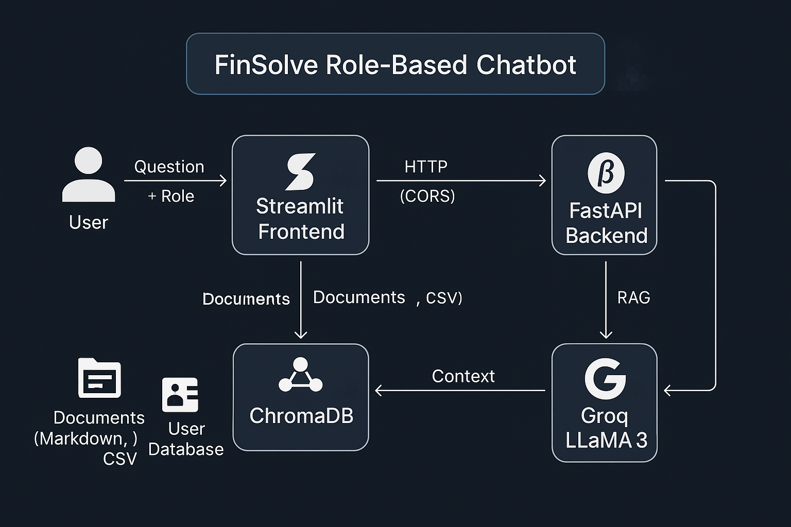

# 🤖  Role-Based Chatbot
A secure, Role-Based Access Control (RBAC) chatbot built with FastAPI, Streamlit, and ChromaDB (RAG). It allows department-specific querying with context-aware AI responses powered by LLaMA 3 (via Groq API).


## Architecture



<br>
🔧 Features
✅ User Authentication (Session-based login/logout)
🔐 Role-based access to department-specific documents
📄 Ingests Markdown & CSV files (multi-department support)
📚 Retrieval-Augmented Generation (RAG) using ChromaDB
💬 Answers via LLaMA 3 (Groq API)
🌐 Web interface using Streamlit
🧠 Semantic search with MiniLM embeddings
🪪 No cross-department data leakage

<br>

# 📁 Project Structure
role-based-chatbot/
│
├── api.py                 ← FastAPI backend (login, RAG, auth)
├── department.py          ← RAG logic, embedding, Chroma ingestion
├── users.json             ← User credentials and roles
├── chatbot_ui.py          ← Streamlit frontend interface
│
├── data/
│   ├── finance/
│   │   └── *.md           ← Markdown files for Finance
│   ├── marketing/
│   │   └── *.md           ← Markdown files for Marketing
│   ├── engineering/
│   │   └── *.md           ← Markdown files for Engineering
│   ├── general/
│   │   └── *.md           ← Markdown files for general access
│   └── hr/
│       └── hr_data.csv    ← CSV data for HR department
│
├── .env                   ← API keys and secrets
└── requirements.txt       ← Python dependencies

<br>

⚙️ Technologies Used

Category	Tool / Library
Backend API	FastAPI
Frontend UI	Streamlit
Embeddings	all-MiniLM-L6-v2 via sentence-transformers
Vector DB	ChromaDB
LLM	LLaMA 3 (Groq API)
Environment	python-dotenv
File Parsing	langchain.text_splitter for Markdown/CSV
Session Mgmt	starlette.middleware.sessions

<br>

1. Clone the Repo
git clone https://github.com/your-username/finSolve-role-based-chatbot.git
cd finSolve-role-based-chatbot

2. Create & Activate Virtual Environment
python -m venv env
source env/bin/activate     # On Windows: env\Scripts\activate

3. Install Requirements
    ```bash
    pip install -r app/requirements.txt
    ```
4. Create .env File
GROQ_MODEL=llama3-8b-8192
GROQ_API_KEY=your_groq_api_key

5. Run FastAPI Backend
uvicorn api:app --reload

6. Run Streamlit Frontend
streamlit run chatbot_ui.py
<br>
